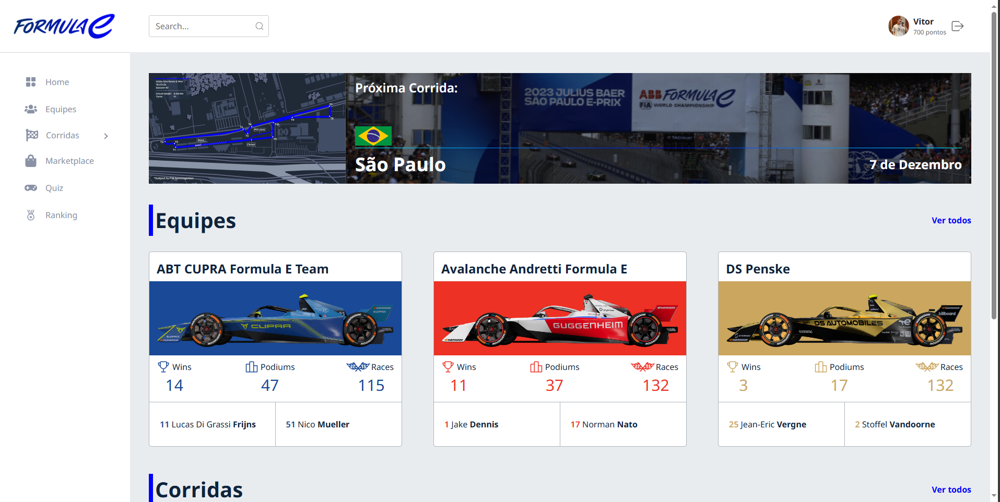

# Formula E Live Hub

## Sobre
O **Formula E Live Hub** é uma plataforma dedicada aos fãs de Fórmula E, oferecendo uma experiência imersiva e interativa durante as corridas. Através de uma interface intuitiva, os usuários podem acessar informações detalhadas sobre pilotos e provas em tempo real.

### Funcionalidades:
- **Informações em tempo real**: Acompanhe dados ao vivo dos pilotos, como temperatura, velocidade e umidade. Também estão disponíveis dados de temperatura e umidade da pista.

- **Chat ao vivo**: Interaja com outros fãs em tempo real enquanto acompanha as corridas.

- **Quiz interativo**: Teste seus conhecimentos sobre Fórmula E e acumule pontos.
- **Marketplace**: Troque pontos por produtos reais no marketplace.
- **Ranking**: Confira a lista das pessoas com mais pontos.
- **Chute da sorte**: Faça palpites sobre o desempenho dos pilotos e participe de uma experiência ainda mais interativa.

O **Formula E Live Hub** é a central definitiva para todos os entusiastas da categoria elétrica do automobilismo!

## Tecnologias Utilizadas
- **Frontend**:
  - HTML
  - CSS
  - React
- **Backend**:
  - Node.js (para o chat em tempo real)
  - TypeScript (para a criação dos endpoints)
  - TypeORM (para a integração com o banco de dados)
- **Banco de Dados**:
  - MongoDB (armazenamento de dados do chat)
  - PostgreSQL (armazenamento de dados de usuários e informações da Fórmula E)

## Acesso didático
- Usuário: professor.fiap
- Senha: 1234

## Links
- [Deploy da Aplicação](https://formulaelivehub.netlify.app)

## Desenvolvedores
| Desenvolvedor | Avatar | RM |
| ------------- | ------ | -- |
|  |  | RM555206 |
|  |  | RM554901 |
|  |  | RM558358 |
|  |  | RM555026 |
